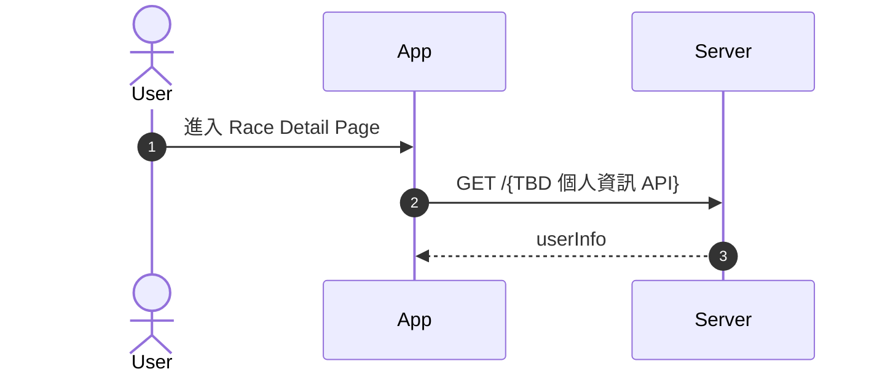
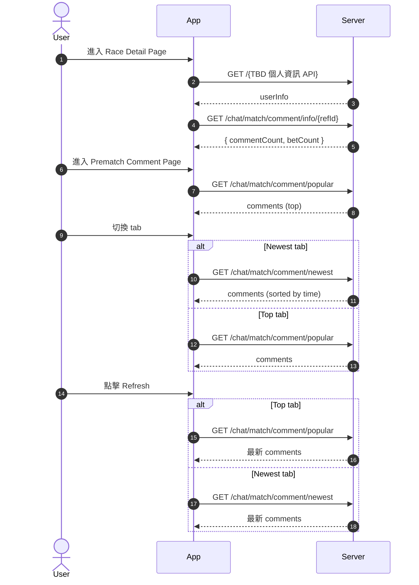
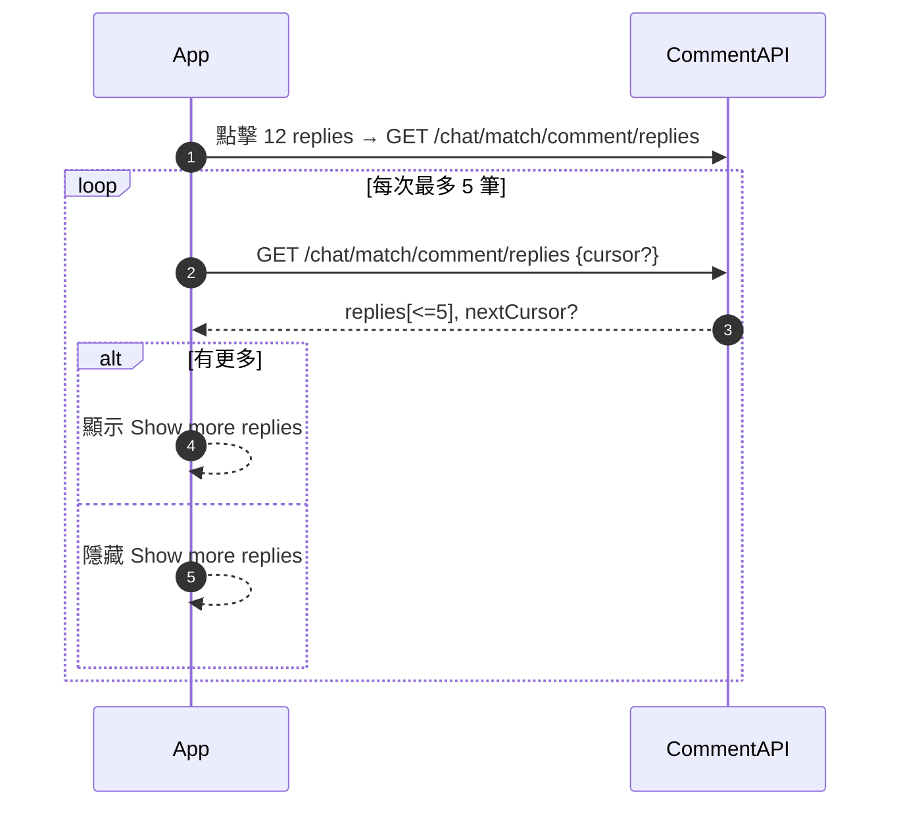
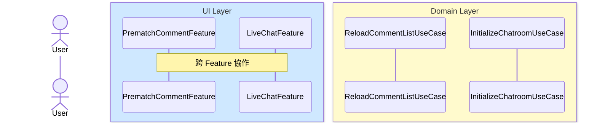
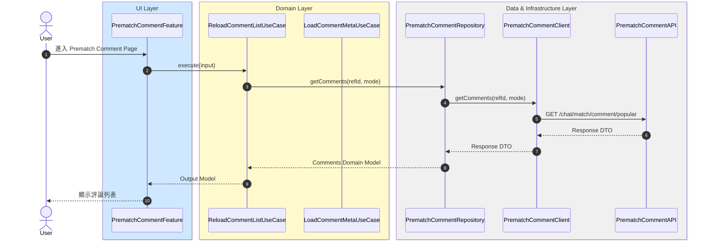

# MermaidToTDD

一個自動化工具，將 Mermaid Sequence Diagram 轉換為符合 **TCA (The Composable Architecture) + Clean Architecture** 的 iOS 技術設計文件（TDD）。

## 📋 目錄

- [專案簡介](#專案簡介)
- [功能特色](#功能特色)
- [快速開始](#快速開始)
- [教學範例](#教學範例)
- [專案結構](#專案結構)
- [規範文件](#規範文件)
- [輸出格式](#輸出格式)
- [安裝 Mermaid Preview 插件](#安裝-mermaid-preview-插件)

---

## 專案簡介

本專案提供一套完整的規範和工具，幫助 iOS 開發團隊將業務流程的 Mermaid Sequence Diagram 自動轉換為結構化的技術設計文件（TDD）。

### 核心價值

- ✅ **自動化轉換**：從 Mermaid 流程圖自動生成完整的 TDD 文件
- ✅ **架構規範**：嚴格遵循 TCA + Clean Architecture 原則
- ✅ **模組化設計**：自動識別並收斂相關模組
- ✅ **標準化輸出**：統一的文件格式和結構

---

## 功能特色

### 1. 自動化分析與轉換

- 解析 Mermaid Sequence Diagram
- 識別各層級（UI Layer、Domain Layer、Data & Infrastructure Layer）
- 自動收斂相關模組（Feature、UseCase、Repository、Client、API）

### 2. 完整的 TDD 文件生成

自動生成以下章節：

1. **Integrated Service-Level Sequence Diagram (ISSD)**
   - 高層級的服務整合流程圖

2. **Architecture（架構圖）**
   - Clean Architecture 分層架構圖

3. **Module Responsibility（模組職責）**
   - 所有模組的職責說明（表格格式）

4. **Domain Model（領域模型）**
   - Entity 和 Value Object 定義
   - Domain Model 關係圖（語意化 + 標準 UML）

5. **Module Sequence Diagrams（模組序列圖）**
   - 詳細的模組互動序列圖
   - 按功能分類組織

---

## 快速開始

### 1. 準備 Mermaid Sequence Diagram

準備你的 Mermaid Sequence Diagram，格式如下：



**重要標註**：
- 使用 `@feature: FeatureName` 標註功能名稱
- 使用 `@flow: Full/Sub` 標註流程類型

### 2. 使用 Cursor Agent

在 Cursor IDE 中，將你的 Mermaid 流程圖和 `tdd_main_prompt.md` 提供給 AI Agent，Agent 會自動：

1. 解析 Mermaid 流程圖
2. 識別各層級和模組
3. 生成完整的 TDD 文件
4. 輸出到 `output/` 資料夾

### 3. 查看輸出結果

生成的 TDD 文件會自動組織在 `output/` 資料夾中，按功能分類。

---

## 教學範例

以下是一個完整的教學範例，展示如何從 Mermaid 流程圖生成 TDD 文件。

### 範例：PrematchComment Feature

#### 輸入：Mermaid Sequence Diagram

**注意**：在實際使用時，你可以提供多個 `sequenceDiagram`，每個都需要獨立的 Mermaid 代碼塊。以下是完整的輸入範例：

**主流程：**



**子流程範例（Replies Pagination）：**



**其他子流程：**

你還可以提供其他子流程，例如：
- Like Flow（點讚流程）
- Comment / Reply Publish（發布評論/回覆）
- Profile Navigation（個人資料導航）

每個流程都應該使用獨立的 Mermaid 代碼塊，並標註 `@feature` 和 `@flow` 標籤。

#### 輸出：自動生成的 TDD 文件

系統會自動生成完整的 TDD 文件，包含以下章節：

##### 必需章節（6 個）

1. **01. Overview（概述）**
   - 整體描述 Feature 或 Module 的目的
   - 包含 scope / goal / 主要使用者互動

2. **02. Integrated Service-Level Sequence Diagram (ISSD)**
   - 高層級的服務整合序列圖
   - 顯示跨 Feature、跨 UseCase 的整合流程

3. **03. Architecture（架構）**
   - Clean Architecture 分層架構圖
   - 說明各層級的責任與依賴方向

4. **04. Module Responsibility（模組職責）**
   - 所有模組的職責說明（表格格式）
   - 包含 Feature、UseCase、Repository、Client、API、Shared Modules

5. **05. Domain Model（領域模型）**
   - Entity 和 Value Object 定義
   - Domain Model 關係圖（語意化 + 標準 UML）
   - DTO → Domain Model Mapping 規則

6. **06. Module Sequence Diagram（模組序列圖）**
   - 詳細的模組互動序列圖
   - 按功能分類組織（Data Initialization、Data Interaction、Structural Navigation）

##### 可選章節（Optional）

7. **07. Feature State & Action (TCA)** ⚠️ Optional
   - 每個 Feature 的 State 結構定義
   - 所有 Action 及其語意
   - 哪些 Action 會觸發哪些 UseCase

8. **08. UseCase Input & Output Model** ⚠️ Optional
   - 每個 UseCase 的 Input Model 定義
   - 每個 UseCase 的 Output Model 定義
   - 與 Domain Model、DTO 的關係

9. **09. API Spec & Mapping** ⚠️ Optional
   - URL / Method 定義
   - Request DTO / Response DTO 定義
   - 所屬 Repository / Client / UseCase
   - DTO → Domain Model Mapping 規則

10. **10. Error Handling** ⚠️ Optional
    - 每個 UseCase 的錯誤分類（Validation / Network / Backend）
    - UI 呈現方式
    - 是否自動 retry / reconnect

11. **11. Test Scenarios** ⚠️ Optional
    - 依照 alt / opt / loop 推導所有測試案例
    - 包含 Basic、Branch、Optional、Loop、Error、Recover、Edge Case

12. **12. Risks & Questions** ⚠️ Optional
    - 未定義的需求
    - 不確定的 Backend 行為
    - 時序 / 效能 / TTL / retry policy 的風險
    - TODO / 需後端確認項

#### 完整輸出結構範例

```
output/
└── [FeatureName]/
    ├── 01_Overview/
    │   ├── README.md
    │   └── 01_overview.md
    ├── 02_Integrated Service-Level Sequence Diagram/
    │   ├── README.md
    │   └── 01_full_integration_flow.md
    ├── 03_Architecture/
    │   ├── README.md
    │   └── 01_clean_architecture_diagram.md
    ├── 04_Module Responsibility/
    │   ├── README.md
    │   └── 01_module_responsibility.md
    ├── 05_Domain Model/
    │   ├── README.md
    │   ├── 01_domain_model.md
    │   └── 02_domain_model_uml_standard.md
    ├── 06_Module Sequence Diagram/
    │   └── [FeatureName]/
    │       └── Module Sequence Diagrams/
    │           ├── README.md
    │           ├── 01_data_initialization_refresh.md
    │           ├── 02_data_interaction_load_replies.md
    │           ├── 03_data_interaction_toggle_like.md
    │           ├── 04_data_interaction_publish_comment.md
    │           └── 05_structural_navigation_profile.md
    ├── 07_Feature State & Action (TCA)/ ⚠️ Optional
    │   ├── README.md
    │   └── 01_feature_state_action.md
    └── 08_UseCase Input & Output Model/ ⚠️ Optional
        ├── README.md
        └── 01_usecase_input_output.md
```

#### 各章節輸出範例

**1. Overview（概述）**

整體描述 Feature 的目的、範圍和主要使用者互動：

| 項目 | 說明 |
|------|------|
| **Feature 名稱** | PrematchComment / LiveChat |
| **目的** | 提供賽事前評論功能和即時聊天功能 |
| **範圍** | 評論列表、點讚、發布評論、即時聊天訊息 |
| **主要使用者互動** | 瀏覽評論、點讚、發布評論、發送聊天訊息 |

**2. Integrated Service-Level Sequence Diagram (ISSD)**

高層級的整合序列圖，顯示多個 Feature 之間的協作：



**3. Architecture（架構圖）**

Clean Architecture 分層架構圖，展示各層級的依賴關係。

**4. Module Responsibility（模組職責表格）**

以表格形式列出所有模組的職責：

| 模組名稱 | 層級 | 職責 | 使用的 UseCase |
|---------|------|------|---------------|
| **PrematchCommentFeature** | Domain Layer - Feature Layer | 1. UI orchestration<br>2. 將 Action 轉為 UseCase Input<br>3. 呼叫 UseCase | 1. ReloadCommentListUseCase<br>2. LoadCommentMetaUseCase |

**5. Domain Model（領域模型）**

定義 Entity 和 Value Object：

| Entity 名稱 | 說明 | 屬性 |
|------------|------|------|
| **Comment** | 評論實體 | 1. `id: String`<br>2. `content: String`<br>3. `authorId: String` |

**6. Module Sequence Diagram（模組序列圖）**

詳細的模組互動序列圖，符合規範的格式（User actor 獨立、Layer box 分色、Repository/Client/API 相鄰排列）：



**每個序列圖文件包含：**
- 符合規範的 Mermaid Sequence Diagram
- 模組說明
- 流程說明

---

## 專案結構

```
MermaidToTDD/
├── README.md                          # 本文件
├── tdd_main_prompt.md                 # 主要提示文件（給 AI Agent 使用）
├── .gitignore                         # Git 忽略設定
├── TDD_rules/                         # 規範文件目錄
│   ├── tdd_layers_and_responsibilities.md
│   ├── tdd_module_consolidation_rules.md
│   ├── tdd_usecase_consolidation_rules.md
│   ├── tdd_sequence_and_mermaid_rules.md
│   └── tdd_domain_api_test_and_structure.md
└── output/                            # 生成的 TDD 文件（已加入 .gitignore）
    └── [FeatureName]/
        ├── 01_Integrated Service-Level Sequence Diagram/
        ├── 02_Architecture/
        ├── 03_Module Responsibility/
        ├── 04_Domain Model/
        └── [FeatureName]/
            └── Module Sequence Diagrams/
```

---

## 規範文件

本專案包含 5 個核心規範文件，定義了完整的轉換規則：

### 1. TDD Layers & Responsibilities

定義各層級的職責和依賴方向：
- UI Layer
- Domain Layer (Feature + UseCase)
- Domain Model Layer
- Data & Infrastructure Layer (Repository + Client + API)

### 2. TDD Module Consolidation Rules

定義模組收斂規則：
- 同一資源、同一 bounded context 的模組應合併
- Repository / Client / API 的分層規則

### 3. TDD UseCase Consolidation Rules

定義 UseCase 收斂規則：
- 何時合併多個 UseCase
- UseCase 命名規範

### 4. TDD Sequence & Mermaid Rules

定義序列圖生成規則：
- Layer box 配置和顏色
- User actor 獨立顯示
- Data Infrastructure Layer 的相鄰排列規則
- Note 使用中文

### 5. TDD Domain, API, Test & TDD Structure

定義完整的 TDD 文件結構：
- Domain Model 定義（Entity / Value Object）
- DTO 轉換規則
- 表格格式規範
- 完整 TDD 章節結構

---

## 輸出格式

### 文件組織

生成的 TDD 文件按以下結構組織：

```
output/
└── [FeatureName]/
    ├── 01_Integrated Service-Level Sequence Diagram/
    │   ├── README.md
    │   └── 01_full_integration_flow.md
    ├── 02_Architecture/
    │   ├── README.md
    │   └── 01_clean_architecture_diagram.md
    ├── 03_Module Responsibility/
    │   ├── README.md
    │   └── 01_module_responsibility.md
    ├── 04_Domain Model/
    │   ├── README.md
    │   ├── 01_domain_model.md
    │   └── 02_domain_model_uml_standard.md
    └── [FeatureName]/
        └── Module Sequence Diagrams/
            ├── README.md
            └── [編號]_[類型]_[名稱].md
```

### 表格格式規範

所有表格中的分行內容使用 **number list（數字列表）** 格式：

```
| 屬性 | 1. `id: String` - 評論 ID<br>2. `content: String` - 評論內容 |
```

---

## 安裝 Mermaid Preview 插件

### Cursor 內建的 Markdown Preview

**好消息！** Cursor 已經內建了 Markdown Preview 功能，你可以直接使用：

- **快捷鍵**：
  - macOS: `Cmd+Shift+V`（側邊預覽）或 `Cmd+K V`（分屏預覽）
  - Windows/Linux: `Ctrl+Shift+V`（側邊預覽）或 `Ctrl+K V`（分屏預覽）

- **右鍵選單**：在編輯器中右鍵點擊 Markdown 檔案，選擇「Open Preview」

### 安裝 Mermaid 支援插件

雖然 Cursor 有內建的 Markdown Preview，但預設可能不支援 Mermaid 圖表渲染。建議安裝以下插件來啟用 Mermaid 支援：

### 方法 1：使用 Cursor Agent 自動安裝

在 Cursor IDE 中，將 `install_mermaid_plugin.md` 文件中的指令提供給 AI Agent，或直接使用以下指令：

```
請幫我安裝 Mermaid Preview 插件到 Cursor IDE，讓 Markdown Preview 可以渲染 Mermaid 圖表。請執行以下步驟：

1. 先找到 Cursor 的可執行文件路徑：
   which cursor

2. 使用找到的路徑安裝 Markdown Preview Mermaid Support 插件（推薦）：
   cursor --install-extension bierner.markdown-mermaid

3. 安裝完成後，請驗證插件是否已安裝：
   cursor --list-extensions | grep mermaid

4. 驗證 Mermaid 預覽功能：
   - 打開任何包含 Mermaid 代碼的 .md 文件
   - 使用 Cmd+Shift+V (macOS) 或 Ctrl+Shift+V (Windows/Linux) 打開預覽
   - 確認 Mermaid 圖表可以正常渲染
```

### 方法 2：手動安裝

1. 打開 Cursor IDE
2. 按 `Cmd+Shift+X` (macOS) 或 `Ctrl+Shift+X` (Windows/Linux) 打開擴展面板
3. 搜尋 "Markdown Preview Mermaid Support" 或 "bierner.markdown-mermaid"
4. 安裝 **Markdown Preview Mermaid Support** 插件

### 驗證安裝

安裝完成後：

1. 打開任何包含 Mermaid 代碼的 `.md` 文件
2. 使用 `Cmd+Shift+V` (macOS) 或 `Ctrl+Shift+V` (Windows/Linux) 打開 Markdown Preview
3. 確認 Mermaid 圖表可以正常渲染

**詳細說明請參考**：[install_mermaid_plugin.md](./install_mermaid_plugin.md)

---

## 使用建議

### 1. 準備 Mermaid 流程圖

- 使用清晰的 participant 命名
- 標註 `@feature` 和 `@flow` 標籤
- 保持流程邏輯清晰

### 2. 與 AI Agent 互動

- 提供完整的 Mermaid 代碼
- 參考 `tdd_main_prompt.md` 中的指示
- 檢查生成的輸出是否符合預期

### 3. 檢查輸出

- 確認所有模組都已正確識別
- 檢查序列圖是否符合規範
- 驗證 Domain Model 定義是否完整

---

## 貢獻

歡迎提交 Issue 或 Pull Request 來改進這個專案。

---

## 授權

本專案採用 MIT 授權。

---

## 相關資源

- [TCA (The Composable Architecture)](https://github.com/pointfreeco/swift-composable-architecture)
- [Clean Architecture](https://blog.cleancoder.com/uncle-bob/2012/08/13/the-clean-architecture.html)
- [Mermaid Documentation](https://mermaid.js.org/)

