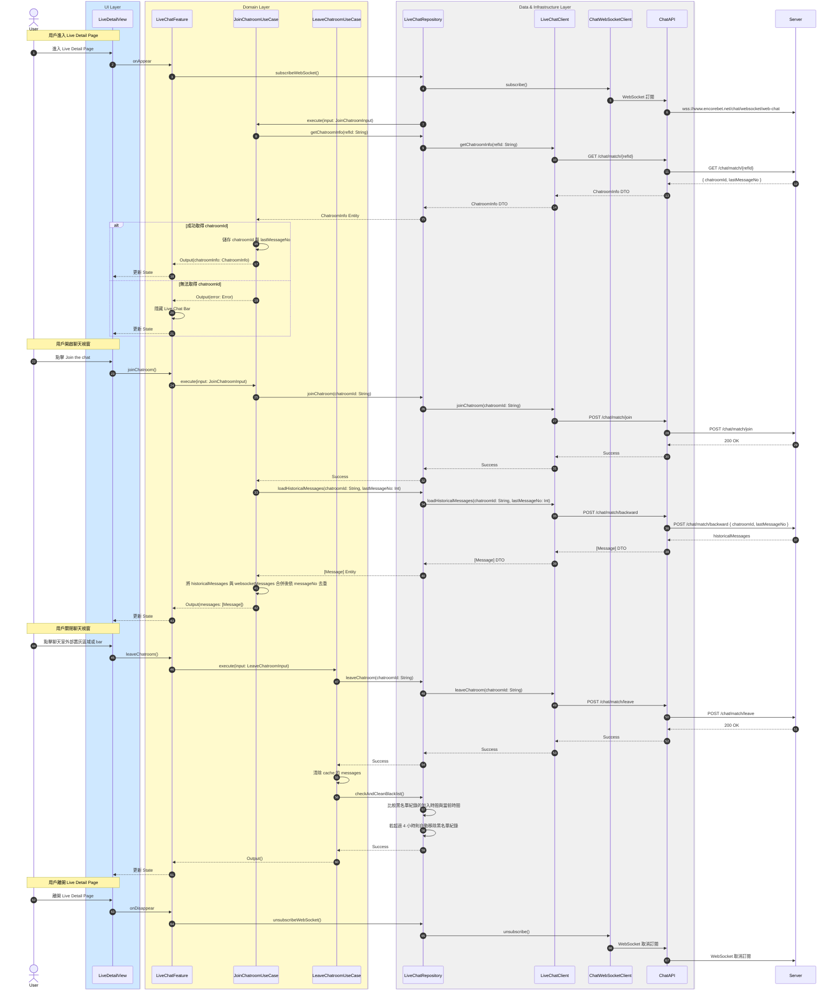

# 初始化聊天室流程

## Flow 資訊

| 欄位 | 值 |
|------|-----|
| **feature** | LiveChat |
| **flow_id** | LC-FULL-001 |
| **flow_type** | Full |
| **flow_name** | 用戶進入與離開聊天室（含 WebSocket 相依） |
| **parent_flow_id** | null |
| **parent_flow_name** | null |
| **original_annotation** | @flow: Full |

## 模組說明

| 模組名稱 | 職責 |
|---------|------|
| **LiveDetailView** | 直播詳情頁面 |
| **LiveChatFeature** | TCA Reducer，管理聊天室相關的 State 和 Action |
| **JoinChatroomUseCase** | 加入聊天室並載入歷史訊息 |
| **LeaveChatroomUseCase** | 離開聊天室並清理快取 |
| **LiveChatRepository** | Domain 資料來源的抽象介面（聊天室相關） |
| **LiveChatClient** | HTTP 通訊（聊天室相關） |
| **ChatWebSocketClient** | WebSocket 通訊（即時訊息） |
| **ChatAPI** | 後端 endpoint 定義（聊天室相關） |

## 流程說明

| 流程步驟 | 說明 |
|---------|------|
| **1. 進入頁面與 WebSocket 訂閱** | 1. 用戶進入 Live Detail Page 2. 自動建立 WebSocket 連線 |
| **2. 取得聊天室資訊** | 1. 向伺服器請求聊天室 ID 和最後訊息編號 2. 成功則儲存資訊，失敗則隱藏 Live Chat Bar |
| **3. 加入聊天室** | 1. 用戶點擊 Join the chat 按鈕 2. 加入聊天室 |
| **4. 載入歷史訊息** | 1. 透過 backward API 載入舊訊息 2. 將歷史訊息與 WebSocket 訊息合併並去重 |
| **5. 離開聊天室** | 1. 用戶關閉聊天室 2. 離開聊天室並清除快取 |
| **6. 離開頁面** | 1. 用戶離開 Live Detail Page 2. 取消 WebSocket 訂閱 |

## 序列圖

