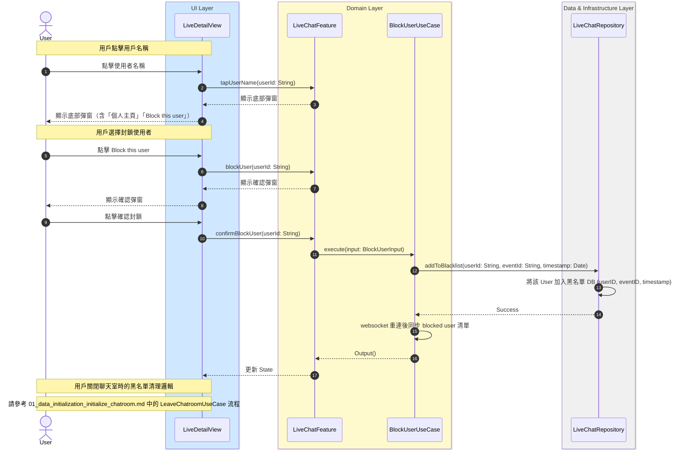

# 封鎖用戶流程

## Flow 資訊

| 欄位 | 值 |
|------|-----|
| **feature** | LiveChat |
| **flow_id** | LC-SUB-002 |
| **flow_type** | Sub |
| **flow_name** | 用戶點擊 avatar 與封鎖其他 user 邏輯 |
| **parent_flow_id** | LC-FULL-001 |
| **parent_flow_name** | 用戶進入與離開聊天室（含 WebSocket 相依） |
| **original_annotation** | @flow: Sub |

## 模組說明

| 模組名稱 | 職責 |
|---------|------|
| **LiveDetailView** | 直播詳情頁面 |
| **LiveChatFeature** | TCA Reducer，管理聊天室相關的 State 和 Action |
| **BlockUserUseCase** | 處理封鎖用戶的邏輯 |
| **LiveChatRepository** | Domain 資料來源的抽象介面（聊天室相關） |

## 流程說明

| 流程步驟 | 說明 |
|---------|------|
| **1. 點擊用戶名稱** | 1. 用戶點擊聊天室中其他用戶的名稱 2. 顯示操作選單（含「個人主頁」「Block this user」） |
| **2. 封鎖用戶** | 1. 用戶選擇「Block this user」 2. 顯示確認彈窗 3. 確認後 Feature 呼叫 BlockUserUseCase 4. UseCase 將該用戶加入黑名單 DB 5. WebSocket 重連後同步 blocked user 清單 |
| **3. 黑名單清理** | 1. 用戶關閉聊天室時執行黑名單檢查 2. 比較黑名單紀錄的加入時間與當前時間 3. 若超過 4 小時則自動移除黑名單紀錄 |

## 序列圖

