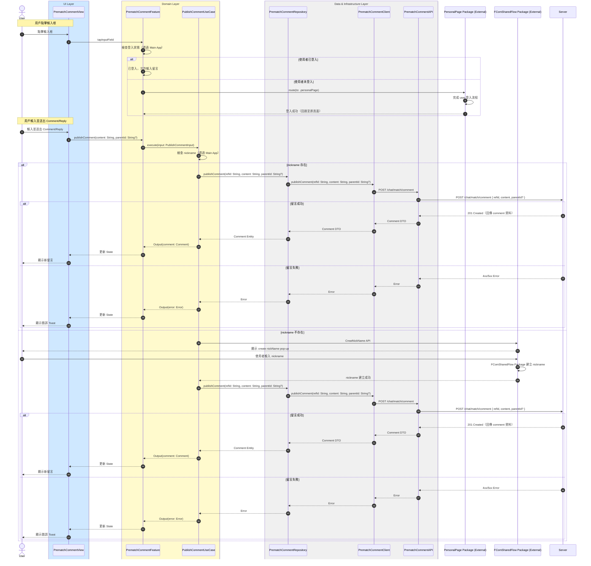

# 發送留言流程

## Flow 資訊

| 欄位 | 值 |
|------|-----|
| **feature** | PrematchComment |
| **flow_id** | PC-SUB-002 |
| **flow_type** | Sub |
| **flow_name** | 用戶發 Comment - Reply（含登入與 nickname 檢查） |
| **parent_flow_id** | PC-FULL-001 |
| **parent_flow_name** | 用戶進入 Upcoming Race Page, Prematch Comment Page 與 Top |
| **original_annotation** | @flow: Sub |

## 模組說明

| 模組名稱 | 職責 |
|---------|------|
| **PrematchCommentView** | 賽前留言頁面 |
| **PrematchCommentFeature** | TCA Reducer，管理評論相關的 State 和 Action |
| **PublishCommentUseCase** | 發送留言或回覆 |
| **PrematchCommentRepository** | Domain 資料來源的抽象介面（評論相關） |
| **PrematchCommentClient** | HTTP 通訊（評論相關） |
| **PrematchCommentAPI** | 後端 endpoint 定義（評論相關） |
| **PersonalPage Package (External)** | 登入流程（外部 Package） |
| **FComSharedFlow Package (External)** | Nickname 建立流程（外部 Package） |

## 流程說明

| 流程步驟 | 說明 |
|---------|------|
| **1. 點擊輸入框與登入檢查** | 1. 用戶點擊輸入框準備輸入留言或回覆 2. 檢查登入狀態 3. 未登入則跳轉到 PersonalPage 完成登入 |
| **2. 輸入並送出留言** | 1. 用戶輸入並送出 Comment/Reply 2. 檢查 nickname 是否存在 |
| **3. 有 nickname 時發送** | 1. 已有 nickname，直接送出留言 2. 顯示新留言 |
| **4. 無 nickname 時發送** | 1. 調用 FComSharedFlow Package 建立 nickname 2. 建立成功後送出留言 3. 顯示新留言 |

## 序列圖

