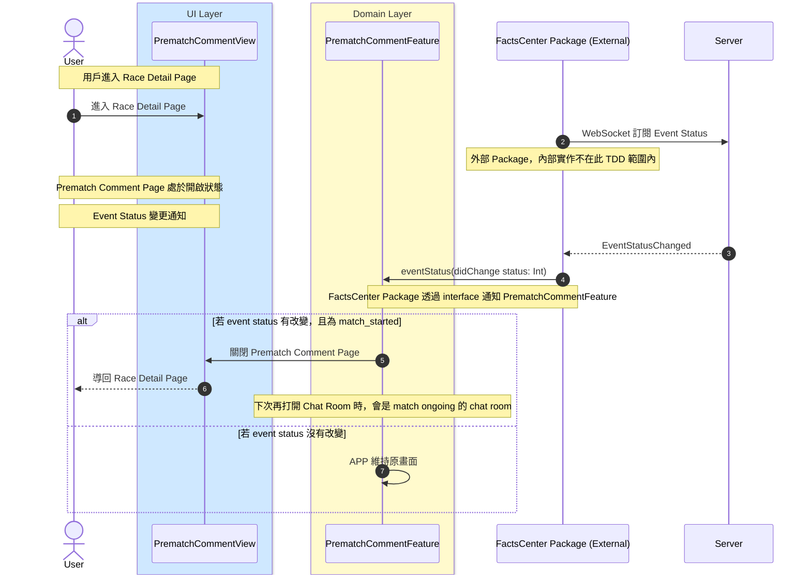

# Event Status 訂閱與通知流程

## Flow 資訊

| 欄位 | 值 |
|------|-----|
| **feature** | PrematchComment |
| **flow_id** | PC-SUB-001 |
| **flow_type** | Sub |
| **flow_name** | Event Status 訂閱與通知流程 |
| **parent_flow_id** | PC-FULL-001 |
| **parent_flow_name** | 用戶進入 Upcoming Race Page, Prematch Comment Page 與 Top |
| **original_annotation** | @flow: Sub |

## 模組說明

| 模組名稱 | 職責 |
|---------|------|
| **PrematchCommentView** | 賽前留言頁面 |
| **PrematchCommentFeature** | TCA Reducer，管理評論相關的 State 和 Action |
| **FactsCenter Package (External)** | Event Status 訂閱與通知（外部 Package） |

## 流程說明

| 流程步驟 | 說明 |
|---------|------|
| **1. Event Status 訂閱** | 1. 用戶進入 Race Detail Page 2. FactsCenter Package（外部）自動透過 WebSocket 訂閱 Event Status |
| **2. Event Status 變更通知** | 1. Prematch Comment Page 處於開啟狀態 2. Server 推送 EventStatusChanged 事件 3. FactsCenter Package 透過 interface 通知 PrematchCommentFeature |
| **3. 處理通知** | 1. 若 event status 有改變，且為 match_started：自動關閉 Prematch Comment Page，導回 Race Detail Page 2. 若 event status 沒有改變：APP 維持原畫面 |

## 序列圖

