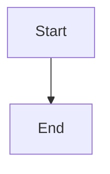

# GitBook Mermaid 疑難排解

## 快速檢查清單

### 1. 確認代碼塊格式

確保每個 Mermaid 代碼塊都使用正確格式：

````markdown
```mermaid
sequenceDiagram
    ...
```
````

**常見錯誤**：
- ❌ 使用四個反引號
- ❌ `mermaid` 拼寫錯誤
- ❌ 代碼塊前後沒有空行
- ❌ 使用 HTML 實體編碼（`&lt;`、`&gt;`）

### 2. 測試簡單的 Mermaid 圖表

在 GitBook 中創建一個測試頁面，使用最簡單的 Mermaid 圖表：

````markdown

````

如果這個可以渲染，說明 GitBook 支援 Mermaid，問題可能在於複雜的 sequenceDiagram 語法。

### 3. 檢查 GitBook 版本

GitBook.com 應該原生支援 Mermaid，但如果無法渲染，可能需要：
- 確認您使用的是最新版本的 GitBook.com
- 檢查是否有更新可用

## 替代方案

### 方案 A：使用 MkDocs + GitHub Pages（推薦）

**優點**：
- ✅ 已完整配置 Mermaid 支援
- ✅ 自動部署
- ✅ 更好的渲染效果

**使用方式**：
1. 代碼已推送到 GitHub
2. 啟用 GitHub Pages（使用 GitHub Actions）
3. 訪問：`https://HsinChungHan.github.io/Ex-TDDToIn-TDD/`

### 方案 B：使用 Mermaid Live Editor 生成圖片

1. 前往 [Mermaid Live Editor](https://mermaid.live/)
2. 貼上 Mermaid 代碼
3. 下載 PNG 或 SVG
4. 上傳到 GitBook 並插入圖片

### 方案 C：使用 HTML 嵌入

如果 GitBook 支援 HTML，可以嘗試：

````html
<div class="mermaid">
sequenceDiagram
    ...
</div>
````

## 聯繫 GitBook 支援

如果以上方法都無法解決，建議：
1. 聯繫 GitBook 支援團隊
2. 提供具體的 Mermaid 代碼範例
3. 說明使用的 GitBook 版本

