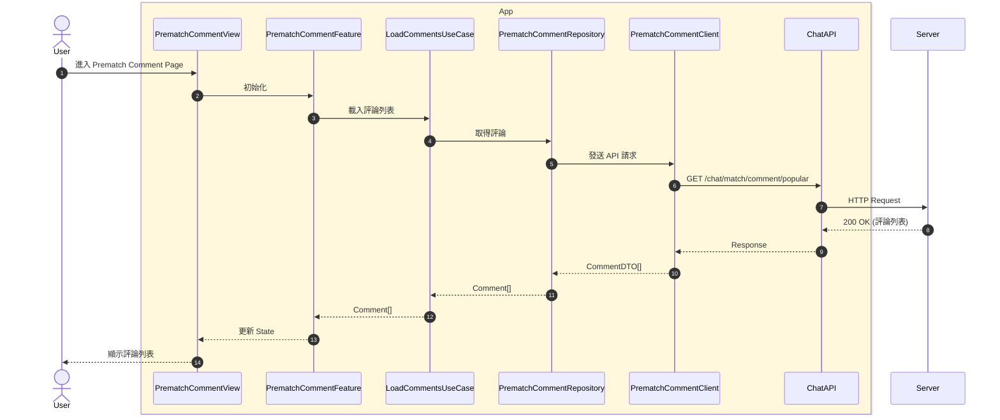

# AI 提示詞範本

本文檔提供階段 2（產生 Input 資料）中使用的 AI 提示詞範本。

---

## 1. 生成 Mermaid Sequence Diagram

### 提示詞範本

```
請根據以下自然語言敘述，生成 Mermaid Sequence Diagram。

## 自然語言敘述

[貼上 Client Side RD 提供的自然語言敘述]

## 要求

1. **使用 Mermaid sequenceDiagram 語法**
2. **標註 Feature 和 Flow 類型**：
   - 使用 `@feature: {FeatureName}` 標註 Feature
   - 使用 `@flow: Full` 或 `@flow: Sub` 標註 Flow 類型
3. **遵循 Clean Architecture 分層**：
   - User（actor，獨立於所有 box 之外）
   - View（UI Layer）
   - Feature（Domain Layer）
   - UseCase（Domain Layer）
   - Repository（Data & Infrastructure Layer）
   - Client（Data & Infrastructure Layer）
   - API（Data & Infrastructure Layer）
   - Server（後端）
4. **使用 box 語法分組 Package**：
   - 使用 `box rgb(255, 248, 220) App` 分組 App 層級的 Package
   - 標註 external/internal Package
5. **使用條件分支和迴圈**：
   - 使用 `alt` 語法標註條件分支
   - 使用 `opt` 語法標註可選流程
   - 使用 `loop` 語法標註迴圈
6. **使用 Note 語法**：
   - 使用 `note over {Participant}` 添加技術備註
   - Note 內容使用中文
7. **包含所有參與者和互動流程**：
   - 確保所有參與者都已定義
   - 確保所有互動流程都已描述

## 範例格式



請生成完整的 Mermaid Sequence Diagram 代碼。
```

---

## 2. 生成 Description（自然語言敘述）

### 提示詞範本

```
請根據以下 Mermaid Sequence Diagram，生成結構化的自然語言敘述。

## Mermaid Sequence Diagram

[貼上 mermaid.md 內容]

## 要求

1. **使用 Markdown 格式**
2. **包含以下章節**：
   - 流程概述（Feature 名稱、Flow 類型、主要目的）
   - 參與者說明（所有參與者及其職責）
   - 流程步驟詳述（詳細描述每個步驟）
   - 技術備註（特殊邏輯、限制條件、待確認事項）
   - 前置條件與限制（如適用）
3. **結構清晰，易於閱讀**
4. **使用中文撰寫**

## 範例格式

```markdown
# {流程名稱}流程說明

## 流程概述

本流程為{主流程/子流程}（{Flow 類型}），主流程為：**{主流程名稱}**（flow_id: {主流程ID}）。

本文件描述{流程目的}的完整流程，包括{主要步驟}等情境。本流程涉及以下參與者：**User（用戶）**、**{View名稱}**、**{Feature名稱}**、**{UseCase名稱}**、**{Repository名稱}**、**{Client名稱}**、**{API名稱}** 和 **Server（伺服器）**。

---

## 1. {步驟 1 名稱}

{步驟 1 的詳細描述}

- **用戶操作**：{用戶操作}
- **{參與者} 行為**：{系統行為}

### 情境 A：{情境 A 名稱}
- **{參與者} 回應**：{回應內容}
- **{參與者} 處理**：{處理方式}

### 情境 B：{情境 B 名稱}
- **{參與者} 回應**：{回應內容}
- **{參與者} 處理**：{處理方式}

---

## 技術備註

1. **{備註 1}**：{說明}
2. **{備註 2}**：{說明}
```

請生成完整的 Description 文件。
```

---

## 3. 生成 YAML Flow Spec

### 提示詞範本

```
請根據以下資料，生成 YAML Flow Spec。

## 輸入資料

### 1. Mermaid Sequence Diagram
[貼上 mermaid.md 內容]

### 2. Description
[貼上 description.md 內容]

### 3. API Spec（如適用）
[貼上相關的 API Spec 內容，特別是 OpenAPI 3.0 格式]

### 4. PRD（如適用）
[貼上相關的 PRD 內容，特別是業務規則和驗收條件]

### 5. UI/UX Spec（如適用）
[貼上相關的 UI/UX Spec 內容，特別是互動流程和狀態定義]

## 要求

1. **遵循 YAML Flow Spec 結構**：
   ```yaml
   features:
     {FeatureName}:
       flows:
         - flow_id: {FLOW_ID}
           flow_type: {Full|Sub}
           flow_name: {流程名稱}
           parent_flow_id: {父流程ID|null}
           parent_flow_name: {父流程名稱|null}
           original_annotation: "@flow: {Full|Sub}"
           mermaid_code: |
             [完整的 Mermaid 代碼]
           description: |
             [完整的自然語言敘述]
           packages:
             - name: {Package名稱}
               type: {external|internal}
               description: {說明}
           api_endpoints: [...]
           scenarios: [...]
           user_actions: [...]
           system_behaviors: [...]
           notes: [...]
   ```

2. **提取 API Endpoints**：
   - 從 Mermaid 代碼中提取所有 API 呼叫
   - 從 API Spec 中提取對應的 API 規格
   - 包含 HTTP Method、URL、Request/Response Schema

3. **提取 Scenarios**：
   - 從 Description 中提取所有情境
   - 從 PRD 中提取業務規則和驗收條件
   - 標註情境類型（Basic、Branch、Optional、Loop、Error）

4. **提取 User Actions**：
   - 從 Description 中提取所有用戶操作
   - 從 UI/UX Spec 中提取互動流程
   - 標註操作類型和觸發條件

5. **提取 System Behaviors**：
   - 從 Description 中提取所有系統行為
   - 標註行為類型和觸發條件

6. **標註 Package 類型**：
   - 根據描述判斷 Package 是 external 還是 internal
   - 關鍵字判斷：
     - external：外部 Package、外部 Swift Package、external package、尚未實作、無法控制、由其他團隊維護
     - internal：內部 Package、internal package

7. **Flow 關係**：
   - 如果是 Sub Flow，標註 parent_flow_id 和 parent_flow_name
   - 如果是 Full Flow，parent_flow_id 為 null

## 範例格式

```yaml
features:
  PrematchComment:
    flows:
      - flow_id: PC-FULL-001
        flow_type: Full
        flow_name: User 進入 Upcoming Race Page, Prematch Comment Page 與 Top/Newest 切換
        parent_flow_id: null
        parent_flow_name: null
        original_annotation: "@flow: Full"
        mermaid_code: |
          [完整的 Mermaid 代碼]
        description: |
          [完整的自然語言敘述]
        packages:
          - name: PrematchComment Package
            type: internal
            description: 賽前評論功能 Package
        api_endpoints:
          - method: GET
            url: /chat/match/comment/popular
            description: 取得熱門評論列表
            request:
              parameters:
                - name: refId
                  type: string
                  required: true
            response:
              status_code: 200
              schema:
                type: object
                properties:
                  comments:
                    type: array
                    items:
                      $ref: '#/components/schemas/CommentDTO'
                  nextCursor:
                    type: string
                    nullable: true
        scenarios:
          - scenario_id: SC-001
            scenario_type: Basic
            description: 用戶進入 Prematch Comment Page 並查看 Top tab 評論列表
            steps:
              - step: 1
                action: User 進入 Prematch Comment Page
              - step: 2
                action: 系統載入 Top tab 評論列表
        user_actions:
          - action_id: UA-001
            action_type: navigation
            description: 進入 Prematch Comment Page
            trigger: User 點擊進入按鈕
        system_behaviors:
          - behavior_id: SB-001
            behavior_type: data_loading
            description: 載入評論列表
            trigger: View 初始化
        notes:
          - "Top tab 使用 GET /chat/match/comment/popular API"
          - "Newest tab 使用 GET /chat/match/comment/newest API"
```

請生成完整的 YAML Flow Spec 文件。
```

---

## 使用建議

### 1. 逐步生成

建議按照以下順序使用 AI 提示詞：

1. **第一步**：使用「生成 Mermaid Sequence Diagram」提示詞
2. **第二步**：使用「生成 Description」提示詞（基於第一步的結果）
3. **第三步**：使用「生成 YAML Flow Spec」提示詞（基於前兩步的結果）

### 2. 審查和調整

AI 生成的內容需要人工審查和調整：

- ✅ 檢查 Mermaid 語法是否正確
- ✅ 檢查是否符合 Clean Architecture 分層
- ✅ 檢查 Flow 關係是否正確
- ✅ 檢查 API Endpoints 是否完整
- ✅ 檢查 Package 類型標註是否正確

### 3. 迭代優化

如果 AI 生成的內容不符合要求，可以：

- 提供更詳細的自然語言敘述
- 明確指出需要調整的部分
- 提供範例或參考資料
- 多次迭代優化

---

**最後更新**：2024-11-21  
**版本**：1.0.0

